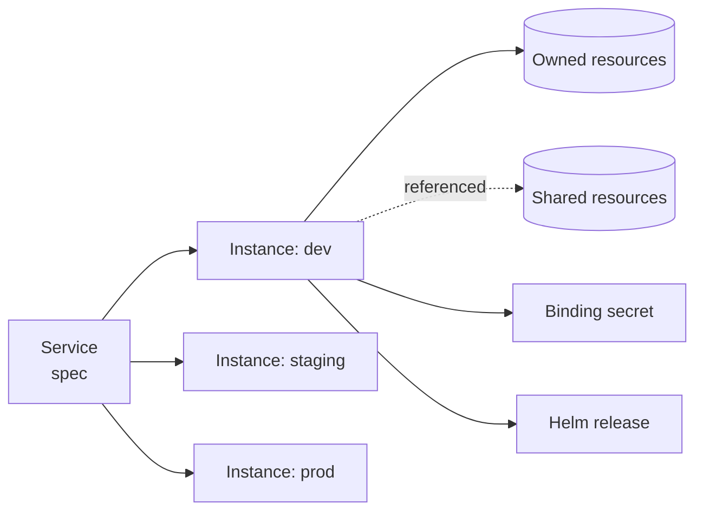

A **Service** is an application and everything it needs to run: the infrastructure it claims, the connection details
it receives, and the Helm release that runs it. Developers describe the service once; InfraKitchen provisions it in
every environment the service is deployed to and keeps each one in line with that description.

## Building blocks

| Entity | What it is |
|---|---|
| **Service** | Name, owners, repository, and a declarative **spec** of claims, bindings and workload |
| **Environment** | One deployment target, e.g. `staging` in one region: tier, rank, credentials, state storage, landing zone, binding sink, approval policy |
| **Service instance** | A service deployed to one environment, with its state, the spec revision it last applied, and the resources it owns |



## The spec

```json
{
  "claims": [
    {"alias": "cache", "template": "aws_redis", "variables": {"node_type": "cache.t4g.small"}},
    {"alias": "db", "template": "aws_rds", "variables": {"engine": "postgres"}}
  ],
  "bindings": [
    {"key": "REDIS_URL", "value": "redis://${cache.outputs.primary_endpoint}:6379"},
    {"key": "DATABASE_HOST", "value": "${db.outputs.address}"}
  ],
  "workload": {
    "mode": "managed",
    "chart": "oci://registry.example.com/charts/app",
    "chart_version": "1.4.0",
    "values_files": ["helm-values/values.yaml", "helm-values/{environment}/values.yaml?"]
  }
}
```

- **Claims** are infrastructure from the offering catalog: templates a platform team marked as claimable. A claim's
  variables may wire another claim's output with `${alias.outputs.name}`. Placement comes from the environment:
  a claim attaches under the environment's landing-zone resources (for example its VPC) or under another claim.
- **Bindings** are the keys the application reads. `runtime` keys are written to the environment's binding sink
  (AWS Secrets Manager under `config-<service>` by default, mounted at `/secrets` by the Secrets Store CSI driver);
  `build` keys are read by CI through the `serviceBuildBindings` query and never contain sensitive outputs.
- **Workload** is the Helm release. In `external` mode it is only recorded and the service's own pipeline deploys
  it. In `managed` mode InfraKitchen applies it after the claims and bindings, so the application never starts
  before its credentials exist.

## Deploying and reconciling

Deploying a service to an environment compiles the spec into a workflow and runs it:

1. Claims are created or updated in dependency order. Resources the spec no longer claims are destroyed.
2. Bindings are rendered from the resources' outputs and written to the binding sink. Only keys InfraKitchen manages
   are touched; anything else in the secret is left alone.
3. A managed workload is applied with its current version.

**Plan** shows what a deploy would do without changing anything. When the spec changes, every instance that has not
applied the new revision shows as **out of date** until it is reconciled. Environments with `approval_required` wait
for an approval before anything runs.

**Destroy** removes the workload first, then the owned resources in reverse dependency order, then the bindings it
wrote. Referenced resources are never touched.

## Owned and referenced resources

| Role | Created by reconcile | Destroyed with the service | Source for bindings |
|---|---|---|---|
| `dependency` (owned) | yes | yes | yes |
| `workload` (owned) | yes | yes | no |
| `referenced` | no | no | yes |

`referenced` is how a service uses shared infrastructure, such as a cluster another team runs, without taking
responsibility for it. A resource has at most one owner and any number of services referencing it.

## Workload versions

Image versions are not part of the spec, so bumping one is not drift. `setWorkloadVersion` rolls a version out
through the service's environments in tier order (dev, staging, prod), then by rank, one environment at a time.
A failure stops the rest of the rollout; a newer version replaces requests that have not started. Each environment
keeps its deploy history, from which a version can be **rolled back** or **promoted** to the next tier.

CI can call it with a per-service **deploy token** or, from GitHub Actions, with the workflow's **OIDC token** once the
`github_oidc` auth provider is enabled: a workflow can deploy only the service whose repository it runs in.

## Graph and impact

The service's **Graph View** shows the services it depends on and the resources each one uses, with referenced
resources drawn dashed. **Impact** turns it around and shows every service that depends on this one. On a resource,
the **Service Impact** tab lists the services that own or reference it and the services depending on those: what
breaks if that resource changes.
